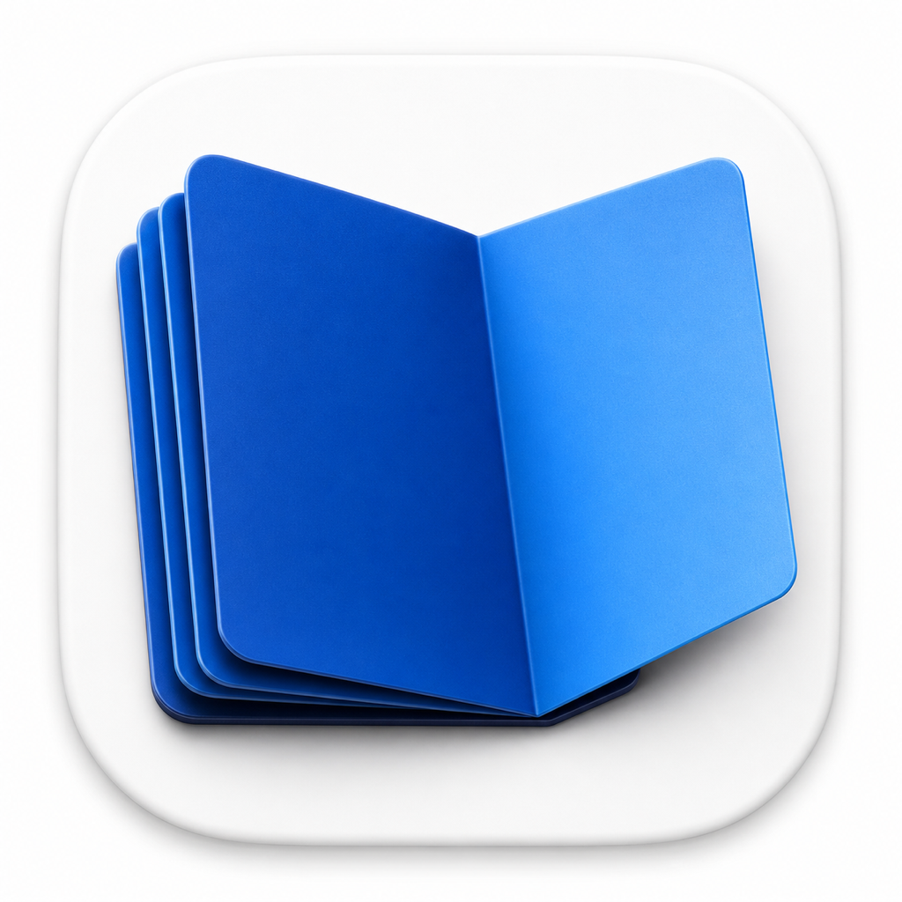

# Nexora

<p align="center">
  
</p>

<p align="center">
  <a href="https://github.com/tghrxxxyyy/Nexora/releases"></a>
  <a href="LICENSE"></a>
  <a href="#"></a>
  <a href="#"></a>
</p>

<p align="center">
  一个面向本地文件的跨平台阅读、预览与编辑工作台。
</p>

<p align="center">
  <a href="#核心能力">核心能力</a> ·
  <a href="#支持的文件">支持的文件</a> ·
  <a href="#开始使用">开始使用</a> ·
  <a href="#构建发布">构建发布</a>
</p>

## 项目简介

**Nexora** 是使用 Flutter 构建的本地文件工作台。它将文件树、编辑器、预览、目录和终端放进一个紧凑的桌面界面，适合阅读文档、浏览项目文件和进行轻量编辑。

Markdown 是当前的重点体验：默认以预览方式打开，支持在预览中直接编辑、目录定位和内容查找。HTML 文件可使用原生 WebView 预览，也可一键交给 Chrome 打开。编辑器同时为常见文本与代码文件提供语法高亮。

## 核心能力

- **多工作区与多文档**：同时打开多个文件夹或独立文件，在顶部标签间快速切换。
- **文件树**：文件夹层级浏览、过滤、单链目录压缩展示，以及按文件类型区分的图标。
- **Markdown 工作流**：预览、源码和分栏三种视图；预览区域支持直接编辑、复制、目录跳转、查找高亮与图片点击预览。
- **HTML 预览**：在应用内预览本地 HTML，并支持使用 Chrome 打开。
- **代码编辑**：面向 Markdown、JSON、YAML、Java、Python、TypeScript、JavaScript、HTML、CSS、SQL、Shell 等格式的文本编辑与语法高亮。
- **目录导航**：从 Markdown 标题自动生成可折叠大纲，默认展开至第二级；点击标题平滑定位到对应内容。
- **查找与替换**：当前文件查找、预览内查找、文件夹范围的全局查找与替换。
- **实时同步**：监听已打开的本地文件和文件夹；外部文件变化会同步提示或刷新。
- **会话恢复**：启动时重新载入上次打开的文件和目录，保留最近打开的 10 项记录。
- **内置终端**：通过本机 PTY 启动用户的交互式登录 Shell，可直接使用原有 Shell 配置与插件；支持底部/右侧停靠、多个独立终端、上下或左右分屏及拖动调整尺寸。
- **主题与界面**：提供亮色和暗色主题；支持在设置中实时调整字体大小，并自动恢复个人偏好。

## 支持的文件

| 类型 | 当前能力 |
| --- | --- |
| `.md` / `.markdown` | 可视化预览、预览内编辑、源码编辑、目录、查找 |
| `.html` / `.htm` | 应用内预览、Chrome 打开、源码编辑 |
| `.png` / `.jpg` / `.jpeg` / `.gif` / `.webp` / `.bmp` / `.ico` / `.tif` | 应用内预览与缩放查看 |
| `.java` / `.py` / `.ts` / `.js` / `.json` / `.yaml` / `.yml` / `.xml` / `.css` / `.sql` / `.sh` | 源码编辑与语法高亮 |
| 其他文本文件 | 打开、编辑、保存与文件树浏览 |

## 快捷键

| 快捷键 | 操作 |
| --- | --- |
| `Command + O` | 打开文件 |
| `Command + Shift + O` | 打开文件夹 |
| `Command + S` | 保存当前文件 |
| `Command + F` | 查找当前文件或 Markdown 预览内容 |
| `Command + Shift + F` | 全局查找 |
| `Command + Shift + H` | 全局替换 |
| `Command + B` | 折叠或展开文件侧栏 |

Windows 和 Linux 使用 `Ctrl` 替代 `Command`。

## 开始使用

### 环境要求

- Flutter SDK `3.12` 或更高版本
- Dart SDK（由 Flutter 提供）
- 对应平台的桌面构建环境
  - macOS：Xcode Command Line Tools
  - Windows：Visual Studio（Desktop development with C++）
  - Linux：系统桌面构建依赖

### 本地运行

```bash
git clone https://github.com/tghrxxxyyy/Nexora.git
cd Nexora
flutter pub get
flutter run -d macos
```

将 `macos` 替换为 `windows` 或 `linux`，即可运行相应桌面端。

## 构建发布

macOS 的 Release 配置固定为 **ARM64**，面向 Apple Silicon 设备发布。每次发布前，请先在 `pubspec.yaml` 更新 `version`，例如当前版本 `1.0.34+35`；前半段用于显示版本，`+` 后的数字为构建号。

### 构建各平台

```bash
# macOS Apple Silicon 正式构建
flutter build macos --release

# Windows 正式构建
flutter build windows --release

# Linux 正式构建
flutter build linux --release
```

构建产物位于对应平台的 `build/<platform>/Build/Products/Release/` 目录。macOS 应用路径为：

```text
build/macos/Build/Products/Release/Nexora.app
```

### macOS 正式打包

以下流程会构建 ARM64 应用并生成 DMG。命令在仓库根目录执行。

```bash
flutter clean
flutter pub get
flutter build macos --release

RELEASE_VERSION="1.0.34"
RELEASE_APP="build/macos/Build/Products/Release/Nexora.app"
RELEASE_DMG="dist/Nexora-${RELEASE_VERSION}-macos-arm64.dmg"

mkdir -p dist
hdiutil create \
  -volname "Nexora" \
  -srcfolder "$RELEASE_APP" \
  -ov \
  -format UDZO \
  "$RELEASE_DMG"
```

将 `RELEASE_VERSION` 改为本次 `pubspec.yaml` 中的显示版本。发布目录只保留当前版本的 `Nexora-<version>-macos-arm64.dmg`，避免混入旧安装包。

### 安装或更新 macOS 应用

如果需要直接将构建产物更新到本机 `/Applications`，先关闭正在运行的 Nexora，再原位同步应用内容：

```bash
RELEASE_APP="build/macos/Build/Products/Release/Nexora.app"
INSTALL_APP="/Applications/Nexora.app"
LSREGISTER="/System/Library/Frameworks/CoreServices.framework/Frameworks/LaunchServices.framework/Support/lsregister"

pkill -f "/Applications/Nexora.app/Contents/MacOS/Nexora" || true
rsync -a --delete "$RELEASE_APP/" "$INSTALL_APP/"
"$LSREGISTER" -u "$RELEASE_APP" || true
"$LSREGISTER" -f "$INSTALL_APP"
flutter clean
killall Dock 2>/dev/null || true
```

`flutter clean` 会移除构建目录中的 `.app`。这一步很重要：macOS 可能将构建目录里的应用也登记到 Launchpad，从而显示重复图标。正式安装后应只保留 `/Applications/Nexora.app` 这一个应用副本。

## 项目结构

```text
lib/
├── models/       # 文档、文件树、工作区与搜索模型
├── services/     # 文件系统、文件监听、会话、搜索和终端服务
├── state/        # 应用与编辑会话状态
├── widgets/      # 桌面界面、预览、编辑器、终端与侧栏
├── app_theme.dart
└── main.dart
assets/
├── fonts/        # Maple Mono CN 字体
├── icon/         # 应用图标
└── terminal/     # 终端资源
```

## 技术栈

- [Flutter](https://flutter.dev/) / Dart
- `re_editor` 与 `re_highlight`：代码编辑和语法高亮
- `webview_flutter`：HTML 与 Markdown DOM 预览
- `xterm` 与 `pty2`：ANSI 终端渲染、直接键盘输入与跨平台伪终端
- `watcher`：本地文件变化监听
- `file_selector`：原生文件与目录选择

## 路线图

- 增强更多代码语言的编辑体验与语言服务集成
- 补充 PDF、Office 等常用文件格式的展示能力
- 持续完善 Windows 与 Linux 平台的原生体验

---

本项目当前以桌面端本地文件工作流为核心，不会上传或托管用户打开的文件内容。
