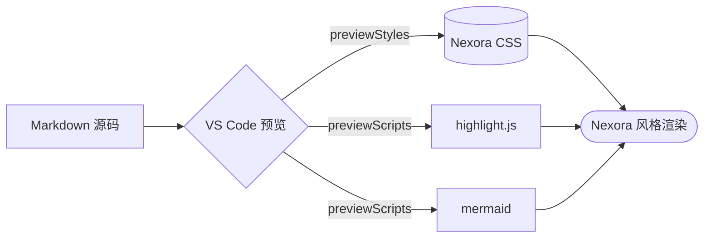

# Nexora Markdown Preview · 样例

> 把这个文件在 VS Code 里用预览打开(`Cmd/Ctrl+Shift+V`)即可看到 Nexora 主题效果。

## 标题层级

### 三级标题 · 装饰条

正文段落,这里是 **加粗(strong)**、*斜体(em)*、~~删除线(del)~~、`行内 code` 与 标记(mark)。还有一个 [带图标的链接](https://code.visualstudio.com)。

#### 四级标题 · 实心圆点

##### 五级标题 · 描边圆点

###### 六级标题 · 长划线

---

## GitHub Callouts

> [!NOTE]
> 有用的信息,用户即使快速浏览也应该注意。

> [!TIP]
> 帮助用户更好地完成某件事的贴心建议。

> [!WARNING]
> 提示用户需要小心的风险。

> [!IMPORTANT]
> 用户必须知道的关键信息。

> [!CAUTION]
> 可能带来负面后果的操作。

## 代码块(Mac 风外壳)

```dart
void main() {
  // Nexora markdown preview theme
  final palette = ['signal', 'acid', 'coral', 'amber'];
  print(palette.map((c) => '#$c').join(', '));
}
```

```typescript
function greet(name: string): string {
  return `Hello, ${name}!`;
}
```

## Mermaid 图表



## 列表

- 无序项一
- 无序项二
  - 嵌套项
- [x] 已完成任务
- [ ] 未完成任务

1. 有序第一
2. 有序第二
  1. 嵌套有序

## 表格

| 语义色 | Light | Dark | 用途 |
| --- | --- | --- | --- |
| signal | `#3298E0` | `#93D9C4` | 主色 / 链接 / 标题强调 |
| acid | `#667E9C` | `#C4D893` | 字符串 / 斜体辅色 |
| coral | `#E97878` | `#E5957C` | 关键字 / 删除 |
| amber | `#F1B454` | `#D8B779` | 数字 / 高亮 |

## 自动目录

[TOC]

## 脚注与键盘

这是一段带脚注的句子^[1](#fn-1)^,快捷键 `Cmd` + `Shift` + `P`。

> 在标题上悬停看动画;在 **加粗**、*斜体*、`code`、链接上悬停看交互反馈。

[^1]: 脚注内容会聚拢到底部卡片里。
